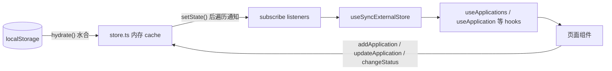

# 求职罗盘 V1.1 技术设计文档（前端补全）

> 文档性质：技术设计文档（TDD）
> 版本：V1.1｜日期：2026-10-04
> 关联文档：《v1.1/求职罗盘_V1.1_前端补全_PRD.md》《docs/求职追踪网站_V1.0_技术设计文档.md》
> 适用范围：纯前端改造，代码位于 `v1.0/job-compass/`，无后端、无新增 npm 依赖

---

## 一、技术背景与约束

| 项 | 结论 |
|---|---|
| 技术栈 | 不变：Next.js 16（App Router）/ React 19 / TypeScript 5 / Tailwind CSS 4 |
| 数据层 | 不变：浏览器 localStorage，`STORAGE_KEY = 'job-compass-data-v1'` |
| 依赖 | 不新增任何 npm 包 |
| 改动范围 | 仅 `v1.0/job-compass/src/` 内的组件、页面与 `lib/` 数据层 |
| 兼容性 | 用户已有 localStorage 存档必须可正常打开，不清空、不要求迁移操作 |

现有数据流（V1.0 已实现，本版沿用）：



核心机制：`store.ts` 持有内存 `cache` 与 `listeners`；`use-store.ts` 通过 `useSyncExternalStore(subscribe, getState, getState)` 订阅。所有页面必须经由 hooks 读数据，**绕过订阅直接调 `store.getXxx()` 是本版要消除的反模式**。

---

## 二、问题技术根因

### 2.1 详情页刷新失效（对应 PRD P1 / F1）

`src/app/applications/[id]/page.tsx` 第 21 行 `getApplication(id as string)` 在渲染期直接读 `cache`：

1. **水合时序问题**：`hydrate()` 在挂载后的 effect 中执行（`use-store.ts` 的 `ensureHydrated`）。直接刷新详情网址时，首帧渲染 `cache` 仍是 `DEFAULT_DATA`，`getApplication` 返回 `undefined`，页面立即渲染「投递记录不存在」。
2. **无订阅不更新**：该组件未经过 `useSyncExternalStore`，页内 `changeStatus` 后 `cache` 已变，但组件不重渲染，状态下拉框停留旧值；同页的时间线（经 `useStatusLogs` 订阅）却会更新，两者自相矛盾。

### 2.2 重复建档卡死（对应 PRD P2 / F3）

两层查重互相打架：

-  UI 层 `new/page.tsx` `handleSave` 调 `checkDuplicate`，命中即拦截；「仍要新建」再次进入 `handleSave`，再次命中，死循环。
-  store 层 `store.ts` `addApplication`（131–135 行）发现重复时 `return d` 静默不写入，但函数仍把构造好的对象返回给调用方——**调用方无法区分保存成功与失败**，即使 UI 放行也会被静默吞掉。

根因：查重职责被错误地拆在两个层级，且 store 层失败不可感知。

### 2.3 简历表单丢数据（对应 PRD P4 / F5）

`resumes/page.tsx` `ResumeForm` 把多段结构硬编码为单段：只读写 `education[0]`、`experiences[0]`、`projects[0]`，且经历的 `company`/`position`/`start`/`end` 没有输入控件，保存时被写为空串。种子数据（`mock-data.ts` 30–63 行）的完整结构一经编辑即被破坏。

### 2.4 其余问题（对应 PRD P3 / P5 / P6 / P7）

- P3：`ApplicationForm` 无条件渲染「AI 已解析」横幅，手填模式误显示。
- P5：`insights/page.tsx` 用 `generateMockWeeklyReport()` 回退填充周报区块，虚构数据与真实数据混淆。
- P6：`page.tsx` 在无投递时同时渲染空看板与空引导。
- P7：`store.ts` 已有 `updateApplication`（149 行）但无任何 UI 入口；`Application.referrer` 字段无表单控件。

---

## 三、详细设计

### 3.1 F1 详情页订阅化

**store.ts 新增**：

```ts
export function isHydrated(): boolean {
  return hydrated;
}
```

`hydrate()` 完成时会遍历 `listeners` 通知（现有逻辑不变），因此订阅者能收到水合完成这一事件。

**use-store.ts 新增**：

```ts
export function useHydrated(): boolean {
  useStore(); // 建立订阅，水合完成时触发重渲染
  return store.isHydrated();
}

export function useApplication(id: string) {
  const data = useStore();
  return useMemo(
    () => data.applications.find((a) => a.id === id),
    [data.applications, id]
  );
}
```

**详情页改造**（`[id]/page.tsx`）：

```tsx
const { id } = useParams();
const hydrated = useHydrated();
const app = useApplication(id as string);

if (!hydrated) {
  return <div className="px-6 py-10 text-center text-gray-400">加载中...</div>;
}
if (!app) {
  return (/* 保持现有「投递记录不存在」UI */);
}
return <ApplicationDetail app={app} />;
```

要点：

- 三态严格区分：**未水合 → 加载态；已水合且无记录 → 不存在；已水合且有记录 → 正常渲染**。
- `ApplicationDetail` 内部的状态切换继续调 `changeStatus`，`app` 引用随订阅自动更新，下拉框与时间线同源。
- 删除投递后 `app` 变为 `undefined`，已水合状态下落入「不存在」分支，符合 PRD 验收。

### 3.2 F2 投递编辑

**表单组件抽取**：将 `new/page.tsx` 内的 `ApplicationForm` 移至 `src/components/applications/ApplicationForm.tsx`，供新建页与详情页共用。组件签名扩展为：

```ts
interface ApplicationFormProps {
  mode: 'create' | 'edit';
  initial?: Application;          // edit 模式必传
  initialCompany?: string;        // 以下为 create+parse 模式的 AI 预填
  initialPosition?: string;
  initialCities?: string[];
  initialSalary?: string;
  jdRaw?: string;
  jdStructured?: StructuredJd;
  onSaved: (id: string) => void;
  onBack?: () => void;
}
```

- 新增 **内推人** 输入框，绑定 `referrer` 字段（类型已存在，无需改 `types.ts`）。
- edit 模式：各字段用 `initial` 初始化；保存调 `updateApplication(initial.id, patch)`，不调 `addApplication`、不做查重；`jdStructured` 保留原值（JD 原文改动后不重新解析，由用户决定是否重新生成报告）。

**入口**：

- 详情页头部加「编辑」按钮，点击后页面主体切换为 `ApplicationForm mode="edit"`（页内编辑态，不新增路由）；保存或取消后返回查看态。
- 列表页操作列加编辑图标，跳转 `/applications/[id]?edit=1`；详情页识别该 query 直接进入编辑态。

**匹配报告过期标记**：`types.ts` 的 `MatchReport` 增加可选字段（向后兼容，旧存档无此字段视为 `false`）：

```ts
export interface MatchReport {
  // ...现有字段不变
  outdated?: boolean; // 岗位信息/JD 在报告生成后被修改
}
```

`store.ts` 新增：

```ts
export function markMatchReportOutdated(applicationId: string) {
  setState((d) => ({
    ...d,
    matchReports: d.matchReports.map((r) =>
      r.applicationId === applicationId ? { ...r, outdated: true } : r
    ),
  }));
}
```

编辑保存 handler 中，若 `patch.jdRaw !== initial.jdRaw` 则调用之。报告区块顶部依据 `report.outdated` 渲染提示条：「JD 已变更，建议重新生成」；重新生成走 `saveMatchReport` 覆盖（现有按 `applicationId` 覆盖逻辑），`outdated` 自然消失。

### 3.3 F3 重复建档修复

**职责划分**：查重完全上移至 UI 层，store 层不再拦截。

**store.ts**：

- `addApplication` 删除 131–135 行的静默 `return d` 分支，任何调用都真实写入。
- `checkDuplicate` 替换为可返回记录的新函数（原函数仅 `new/page.tsx` 一处使用，直接替换）：

```ts
export function findDuplicate(company: string, position: string): Application | undefined {
  return cache.applications.find(
    (a) => a.company.trim() === company.trim() && a.position.trim() === position.trim()
  );
}
```

**new/page.tsx**：

```ts
const [dup, setDup] = useState<Application | null>(null);

const handleSave = (skipDupCheck = false) => {
  if (!company.trim() || !position.trim() || !jd.trim()) return;
  if (!skipDupCheck) {
    const found = findDuplicate(company, position);
    if (found) { setDup(found); return; }
  }
  // ...原有保存逻辑
};
```

提示层两个按钮：

- 「仍要新建」→ `handleSave(true)`，跳过检查直接保存。
- 「去查看」（新增）→ `router.push(`/applications/${dup.id}`)`。

### 3.4 F4 新建页提示修正

`ApplicationForm` 中横幅改为条件渲染，判断依据是「存在 AI 解析结果」：

```tsx
{jdStructured && (
  <div className="bg-blue-50 border border-blue-100 rounded-xl p-3 text-sm text-blue-700">
    <Sparkles className="w-4 h-4 inline mr-1" />
    AI 已解析以下字段，请核对后保存
  </div>
)}
```

手动模式 `ManualForm` 不传 `jdStructured`，横幅自然不出现；「重新解析」返回时 `parsed` 置空，横幅消失。

### 3.5 F5 简历多段表单

**表单状态结构**（`ResumeForm` 内部，文本域与数组字段之间做双向映射）：

```ts
interface EducationFormState { school: string; major: string; degree: string; start: string; end: string; }
interface ExperienceFormState { company: string; position: string; start: string; end: string; bulletsText: string; }
interface ProjectFormState { name: string; role: string; description: string; technologiesText: string; }
```

**初始化映射**（读取兜底，兼容旧存档缺字段）：

```ts
const [education, setEducation] = useState<EducationFormState[]>(
  (initial?.structured.education ?? []).map((e) => ({
    school: e.school ?? '', major: e.major ?? '', degree: e.degree ?? '',
    start: e.start ?? '', end: e.end ?? '',
  }))
);
const [experiences, setExperiences] = useState<ExperienceFormState[]>(
  (initial?.structured.experiences ?? []).map((e) => ({
    company: e.company ?? '', position: e.position ?? '',
    start: e.start ?? '', end: e.end ?? '',
    bulletsText: (e.bullets ?? []).join('\n'),
  }))
);
// projects 同理，technologiesText = (p.technologies ?? []).join('、')
```

**保存映射**（过滤完全空白段，文本域拆回数组）：

```ts
structured: {
  education: education.filter((e) => e.school.trim()),
  experiences: experiences
    .filter((e) => e.company.trim() || e.bulletsText.trim())
    .map((e) => ({
      company: e.company, position: e.position,
      start: e.start || undefined, end: e.end || undefined,
      bullets: e.bulletsText.split('\n').map((s) => s.trim()).filter(Boolean),
    })),
  projects: projects
    .filter((p) => p.name.trim() || p.description.trim())
    .map((p) => ({
      name: p.name, role: p.role || undefined, description: p.description,
      technologies: p.technologiesText ? p.technologiesText.split(/[、,，\s]+/).filter(Boolean) : undefined,
    })),
  skills: skillsText ? skillsText.split(/[、,，\s]+/).filter(Boolean) : [],
  selfIntro: selfIntro || undefined,
}
```

**交互**：每节（教育/经历/项目）渲染动态卡片列表，每段卡片右上角删除按钮，节底部「+ 添加一段」；空节显示「+ 添加」入口。技能与自我评价保持现有单控件。

**文件组织**：`ResumeForm` 及三个子段组件移至 `src/components/resumes/ResumeForm.tsx`（约 250 行，含 `EducationFields` / `ExperienceFields` / `ProjectFields`），`resumes/page.tsx` 仅保留列表与卡片。

### 3.6 F6 空状态收敛

**page.tsx**：

```tsx
{applications.length === 0 ? (
  <空引导 />          // 现有「载入示例数据体验」区块，上移为主体
) : (
  <>
    <统计卡片 />
    <KanbanBoard applications={applications} />
  </>
)}
```

无投递时不渲染 `KanbanBoard`，七列空看板消失；有投递时引导消失。

**insights/page.tsx**：

- 删除 `generateMockWeeklyReport()` 函数及 `displayReports` 回退（约 171 行）。
- `WeeklyReviewSection` 在 `reports.length === 0` 时渲染空态：「本周还没有复盘数据，完成投递状态更新后生成」。

---

## 四、接口变更清单

| 位置 | 函数 / 类型 | 变更 | 说明 |
|---|---|---|---|
| `lib/store.ts` | `isHydrated()` | 新增 | 暴露水合状态 |
| `lib/store.ts` | `findDuplicate(company, position)` | 新增 | 返回重复记录，替代 `checkDuplicate` |
| `lib/store.ts` | `checkDuplicate` | 删除 | 唯一调用方改用 `findDuplicate` |
| `lib/store.ts` | `addApplication` | 修改 | 移除静默查重分支，始终写入 |
| `lib/store.ts` | `markMatchReportOutdated(applicationId)` | 新增 | 标记报告过期 |
| `lib/use-store.ts` | `useHydrated()` | 新增 | 订阅式水合状态 |
| `lib/use-store.ts` | `useApplication(id)` | 新增 | 订阅式单条投递 |
| `lib/types.ts` | `MatchReport.outdated?: boolean` | 新增可选字段 | 向后兼容，旧存档视为 false |
| `lib/types.ts` | 其余类型 | 不变 | 状态枚举、`StructuredJd`、`ResumeStructured` 等均不动 |

## 五、文件改动清单

| 文件 | 改动 |
|---|---|
| `src/lib/store.ts` | 新增 `isHydrated` / `findDuplicate` / `markMatchReportOutdated`；`addApplication` 去拦截；删 `checkDuplicate` |
| `src/lib/use-store.ts` | 新增 `useHydrated` / `useApplication` |
| `src/lib/types.ts` | `MatchReport` 加 `outdated?` |
| `src/app/applications/[id]/page.tsx` | 订阅化三态渲染；页内编辑态；报告过期提示条 |
| `src/app/applications/new/page.tsx` | 改用抽取后的 `ApplicationForm`；`handleSave(skipDupCheck)`；dup 提示层加「去查看」 |
| `src/components/applications/ApplicationForm.tsx` | 新建（从 new/page.tsx 抽取），支持 create/edit 双模式，补 `referrer` 字段，横幅条件渲染 |
| `src/app/applications/page.tsx` | 操作列加编辑入口 |
| `src/components/resumes/ResumeForm.tsx` | 新建（从 resumes/page.tsx 抽取并重构为多段动态表单） |
| `src/app/resumes/page.tsx` | 引用新 `ResumeForm`，删除旧单段表单 |
| `src/app/page.tsx` | 空态时不渲染看板 |
| `src/app/insights/page.tsx` | 删 mock 周报回退，加空态 |

## 六、数据兼容与迁移

1. `STORAGE_KEY` 不变，无迁移脚本，用户无感知。
2. 所有数组字段读取侧兜底 `?? []`，对象字段兜底 `''`（见 3.5 初始化映射）。
3. `MatchReport.outdated` 为可选字段，V1.0 存档中的报告无此字段，按 `false` 处理。
4. `addApplication` 移除拦截后，理论上允许完全重复的记录写入——这是 PRD F3 的明确需求（用户确认后允许并存），查重提示责任在 UI 层。

## 七、验收与测试

1. **手动验收**：逐条执行 PRD 第五节验收清单（12 条 + 示例数据回归）。
2. **构建检查**：`npm run lint` 与 `npm run build` 通过，无类型错误。
3. **重点回归路径**：
   - 刷新详情页 / 新标签页直达详情页
   - 同公司同岗位两次建档（第一次提示、第二次放行）
   - 种子简历编辑后直接保存，比对保存前后 `structured` 字段完整性
   - 清空 localStorage 后首屏仅一处引导，洞察页无虚构数字

## 八、风险与缓解

| 风险 | 影响 | 缓解 |
|---|---|---|
| 水合前首帧闪烁 | 详情页短暂加载态 | `useHydrated` 守门，加载态样式与空态区分 |
| `ApplicationForm` 抽取引入回归 | 新建/编辑双路径 | 抽取后两条路径都过 PRD 验收清单；edit 模式不做查重、不重置 `jdStructured` |
| localStorage 5MB 上限 | JD 原文较大，极端情况写满 | 本版不处理，记录在案；第三轮导入导出提供备份手段 |
| 编辑 JD 后旧报告误导 | 用户看过期结论 | `outdated` 提示条 + 一键重新生成 |
